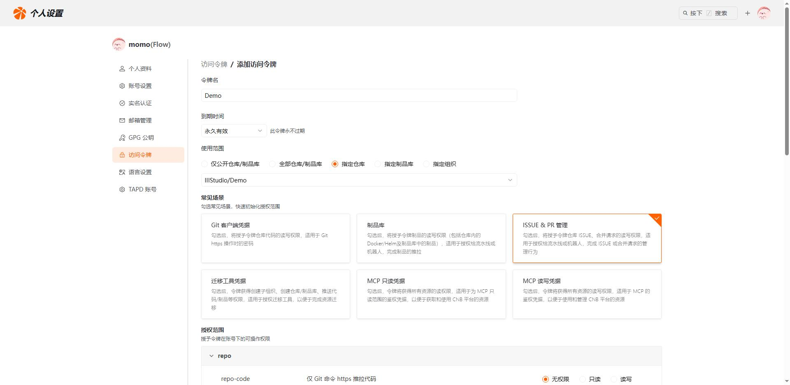
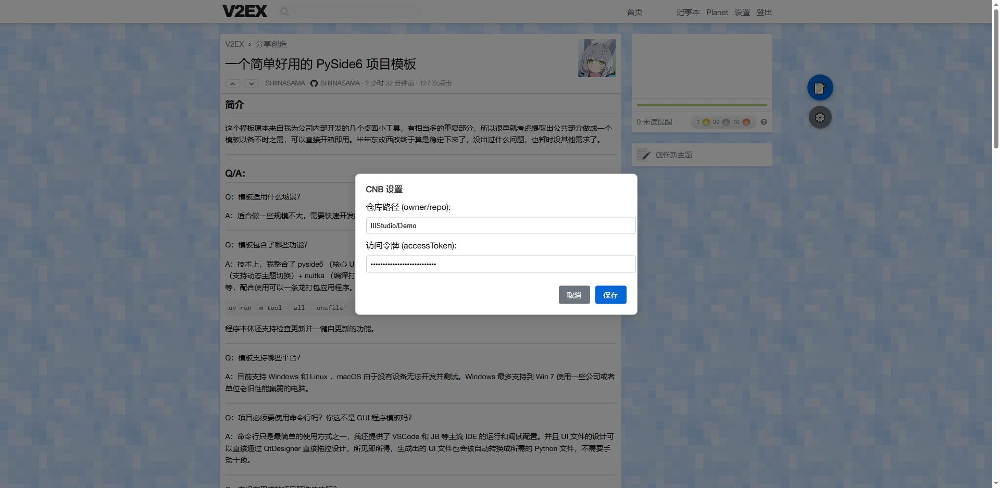
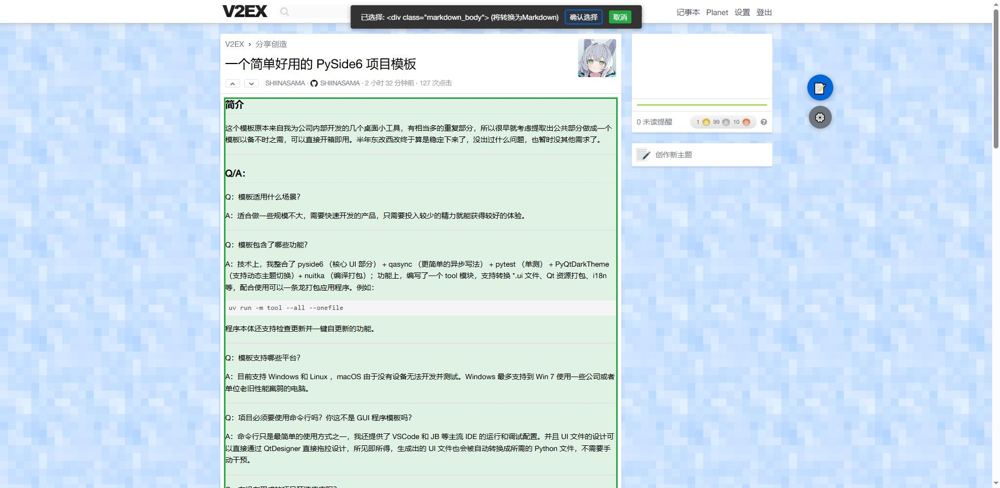
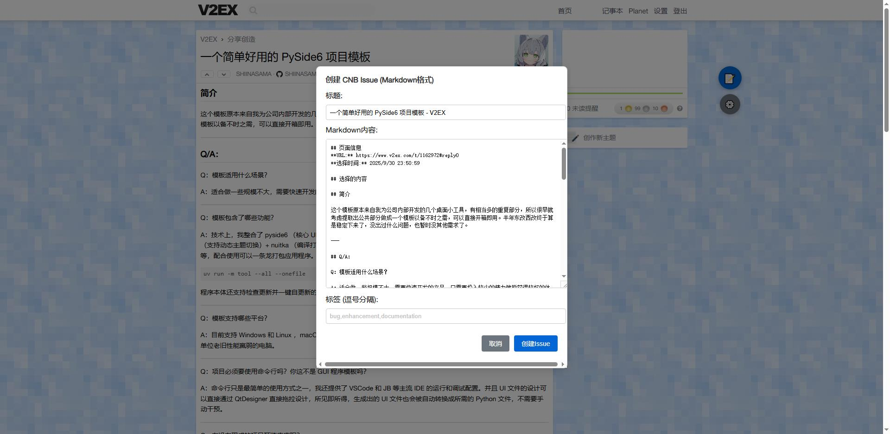
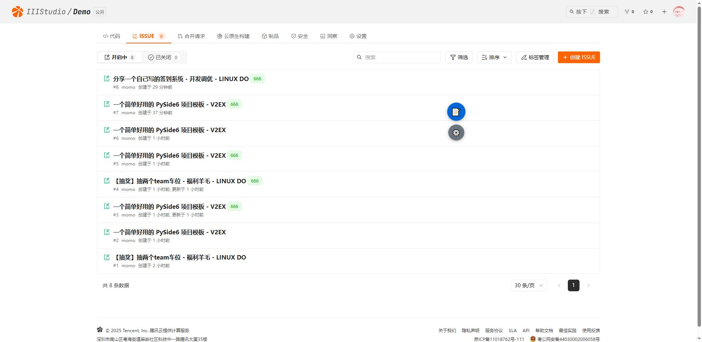

# CNB Issue 区域选择工具（Markdown 版）

一个 Tampermonkey（油猴）脚本：在任意网页上选择页面区域，一键将选中内容从 HTML 转为 Markdown，按“页面信息 + 选择的内容”的格式展示，并可直接通过 CNB 接口创建 Issue。支持链接、图片、代码块/行内代码、标题、列表、表格、引用等常见结构的 Markdown 转换。

> 其实这是一个捡垃圾的脚本！

> **因为我查看文档api发现展示无法新建标签，所以添加标签只能在CNB添加之后，才能在油猴脚本页面添加。**

## 下一次更新

- 优化拖动
- 隐藏按键
- 优化修改页面大小按键消失
- 去掉`// @match *://*/*` 改为自己添加域名
- 优化CSS
- 添加标签选择，因为api无法获取所以标签，方法有但是麻烦，我觉得还是等官方说明。
- 添加修复新建标签功能。

## 功能特性

- 可视化“区域选择模式”
  - 页面右上角悬浮“📝”按钮，点击进入选择模式
  - 鼠标悬停高亮、点击选中 DOM 区域，可确认/取消
- Markdown 转换能力
  - 链接 `<a> →` `[text](url)`
  - 图片 ` →` ``
  - 代码块 `<pre><code class="language-xxx">…</code></pre> →` 
  ```
  xxx … 
  ```
  - 行内代码 `<code>…</code> →` `…`
  - 标题、段落、列表、表格、引用、水平线、换行等
- 创建 Issue（对接 CNB API）
  - 创建成功后，若填写了“标签”，自动再调用接口设置标签
  - Authorization 直接传 token（无需 Bearer 前缀）
- 友好的交互与设置
  - 悬浮“📝”按钮可拖动，位置自动保存
  - 下方“⚙️”设置按钮：配置仓库路径和访问令牌（密码输入）
  - 弹窗中自动填入页面标题、URL、选择时间与 Markdown 内容，可直接编辑后提交

## 截图（示意）





- 选择模式：页面元素蓝色边框高亮，确认选择后弹出“创建 Issue”对话框
- 创建对话框：包含标题输入、Markdown 内容预览/编辑、标签输入（逗号分隔）

## 安装

1) 安装浏览器扩展 Tampermonkey（Chrome/Edge/Firefox 等）
2) 将仓库中 Greasemonkey/CNBIssue.js 脚本内容安装为新脚本
3) 确认脚本的元信息`（@match）`为 `*://*/*`（脚本运行时自行判断站点或直接使用）

提示：脚本已包含所需的权限声明，如 GM_xmlhttpRequest、GM_notification、GM_setClipboard、GM_addStyle、GM_getValue、GM_setValue。

## 使用方法

1) 首次配置
   - 打开任意网页，点击右上角“⚙️”按钮
   - 设置“仓库路径（owner/repo，例如 IIIStudio/Demo）”与“访问令牌（token）”
   - 保存后即可使用

2) 选择区域 → 生成 Markdown → 创建 Issue
   - 点击“📝”进入选择模式，鼠标悬停高亮、点击选中区域
   - 点击“确认选择”
   - 在弹出的对话框中：
     - 标题默认取页面标题，可修改
     - Markdown内容已自动生成（包含“页面信息”和“选择的内容”）
     - “标签”可填写多个，逗号分隔（如：bug,enhancement）
   - 点击“创建Issue”，成功会通知；若填写标签，脚本会在创建后自动设置标签

3) 复制内容（可选）
   - 在对话框的 Markdown 文本框中手动复制粘贴即可

## 配置说明

- 仓库路径 repoPath：形如 `IIIStudio/Demo`
- 访问令牌 accessToken：在“设置”弹窗中以密码输入保存（GM_setValue 存储）
- 接口地址 apiBase：默认 `https://api.cnb.cool`
- Issue 接口路径 issueEndpoint：默认 `/-/issues`

以上固定项（apiBase、issueEndpoint）在脚本内 CONFIG 中定义，如需更改可自行修改源脚本。

## 接口调用细节（CNB）

- 创建 Issue
  - POST: `https://api.cnb.cool/{repoPath}/-/issues`
  - Header:
    - Content-Type: application/json
    - Authorization: <你的 token>（无需 Bearer）
  - Body 示例：
    ```
    {
      "repoId": "IIIStudio/Demo",
      "title": "Issue 标题",
      "body": "Issue 内容（Markdown）",
      "labels": ["bug"],         // 创建时可传，若不能生效会在后续 PUT
      "assignees": []
    }
    ```

- 设置标签（创建成功后，如果填写了标签）
  - PUT: `https://api.cnb.cool/{repoPath}/-/issues/{issueId}/labels`
  - Header:
    - Content-Type: application/json
    - Authorization: <你的 token>
  - Body 示例：
    ```
    {
      "labels": ["string"]
    }
    ```
  - 说明：issueId 由创建接口返回，脚本兼容 id / number / iid / issue_id 多种字段名

## 常见问题

- 创建失败，提示认证或权限问题
  - 请检查访问令牌是否正确有效，仓库路径是否正确
- 标签未设置成功
  - 脚本会在创建成功后再次调用“设置标签”接口；若接口返回错误，会提示“已创建但设置标签失败”
- 未出现悬浮按钮
  - 请确认脚本已启用、所在页面符合 @match 规则（当前默认全站匹配）
- Markdown 转换不完整
  - 目前已覆盖常见结构；若遇到特殊结构可在对话框中手动微调

## 安全与隐私

- 脚本不再硬编码 repoPath 与 accessToken，均由你在“设置”中填写并通过 GM_setValue 存储
- 建议不要在公共环境下暴露令牌；如需更换或清除配置，可在 Tampermonkey 存储中清理对应键值

## 开发说明

- 主要文件：`CNBIssue.js`
- 关键能力：
  - 自定义 DOM 选择 + 高亮
  - HTML → Markdown 转换（a、img、pre/code、code inline、标题/列表/表格/引用等）
  - CNB 接口对接（创建 Issue + 补充设置标签）
  - 悬浮按钮拖动与设置弹窗（GM_getValue/GM_setValue 持久化）
