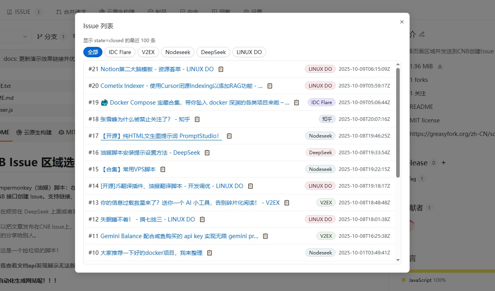
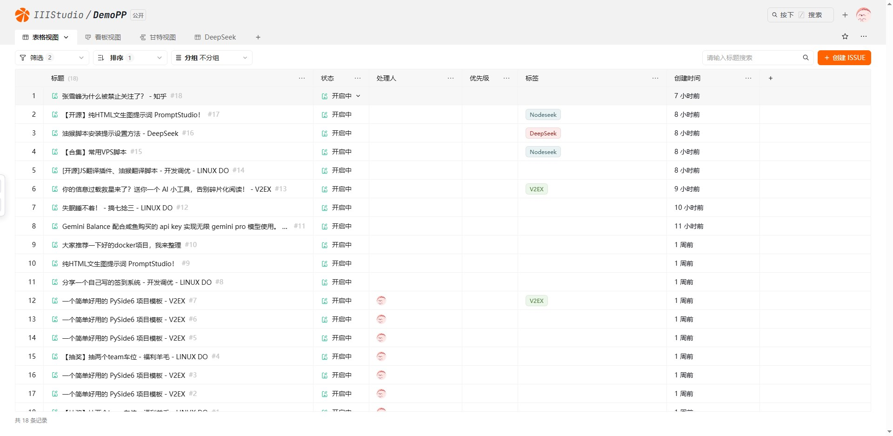
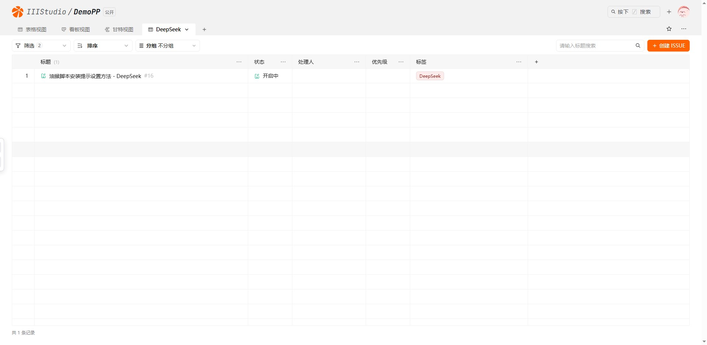
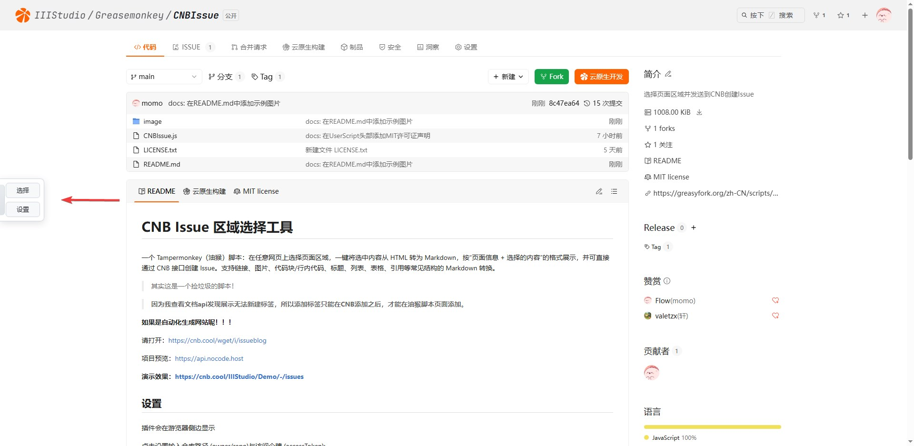
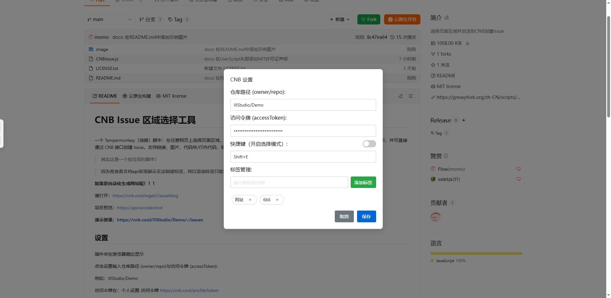
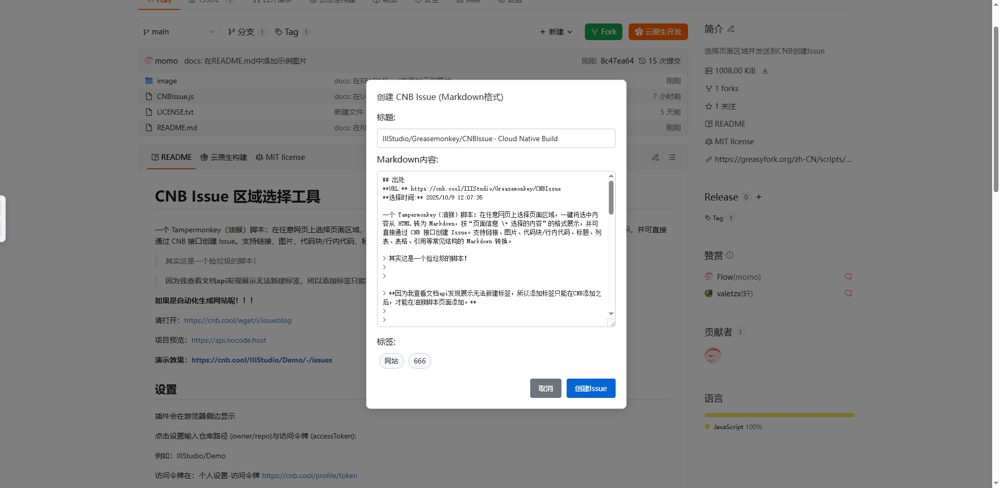

# CNB Issue 区域选择工具

一个 Tampermonkey（油猴）脚本：在任意网页上选择页面区域，一键将选中内容从 HTML 转为 Markdown，按“页面信息 + 选择的内容”的格式展示，并可直接通过 CNB 接口创建 Issue。支持链接、图片、代码块/行内代码、标题、列表、表格、引用等常见结构的 Markdown 转换。

> 你还在烦劳在 DeepSeek 上面或者其他ai回复之后没有收藏功能吗？现在有了，直接选择区域内容转入到CNB。

> 你可以把文章发布在CNB Issue上，然后你去其他网站，你打开列表，找到你要发布的文章，然后点击复制，然后粘贴到你发布的网站上去，你也可以把内容快速的分享给别人。

> 其实这是一个捡垃圾的脚本！

> **因为我查看文档api发现展示无法新建标签，所以添加标签只能在CNB添加之后，才能在脚本页面添加标签才生效。**

**如果是自动化生成网站呢！！！**

请打开：https://cnb.cool/wget/i/issueblog

项目预览：https://api.nocode.host

**演示效果：https://cnb.cool/IIIStudio/Demo/-/issues?q=state%3Aclosed**

## 更新日志
- ### 1.2.4
    - 添加 CNB url安全拦截跳转
- ### 1.2.3
    - 修改 按键默认隐藏
- ### 1.2.2
    - 添加 列表点击复制可以复制标题与内容，内容并转换为md，复制到剪贴板
    - 修改 修复标题过长问题，最长45个字符。

- ### 1.2.1
    - 添加 列表（完成状态才显示！）
    - 添加 创建完成Issue 按键

## 设置

插件会在游览器侧边显示

点击设置输入仓库路径 (owner/repo)与访问令牌 (accessToken):

例如：IIIStudio/Demo

访问令牌在：个人设置-访问令牌 https://cnb.cool/profile/token

新建令牌 输入名称 选择指定仓库 常见场景设置为ISSUE & PR 管理。

## 使用方式

可以点击插件选择，选择区域之后回车确定也可以esc取消。

只是设置快捷键，默认是关闭状态。

**标签是需要你在 -/labels 管理标签中先设置好**，然后在设置中输入标签然后回车，这样就可以使用了

然后点击 创建Issue

## 其他玩法

创建一个数据集

数据范围*
IIIStudio/Demo

例如：https://cnb.cool/IIIStudio/DemoPP

通过筛选标签分类。

## 图片

